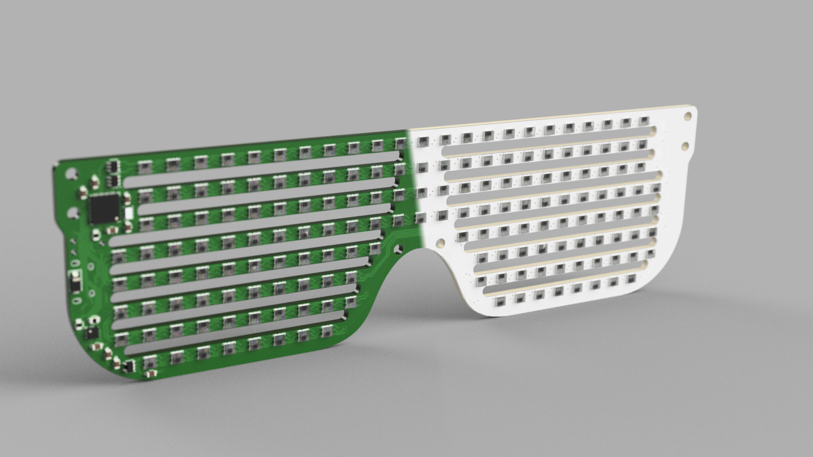
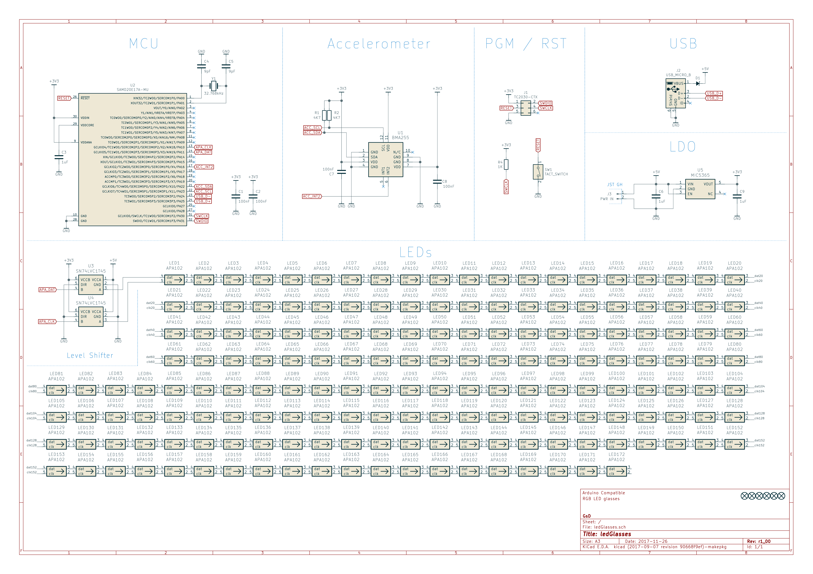
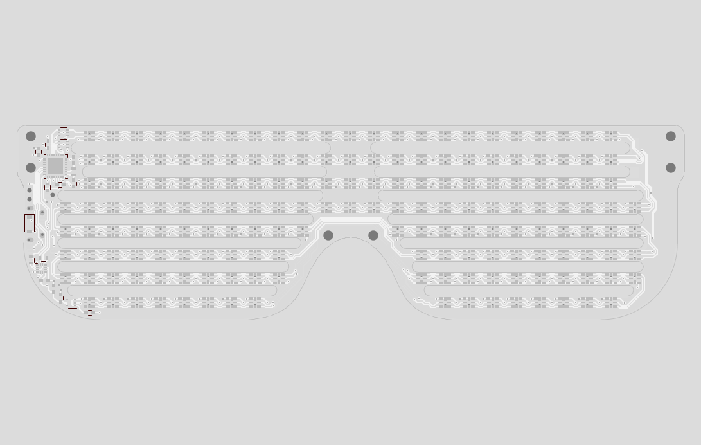

# ledShades

*Simple Arduino compatible RGB LED shades. Using an absurd quantinty of APA102 2020 smart LEDs.*

## 3d Render

When deciding between green and white PCBs I created this render. I ended up using white PCBs for my prototypes. Black would also look good.

---

## Schematic

Schematic is quite simple. The ATSAMD21 is loaded with the Arduino bootloader and programmed with FastLED to control the single array of 173 APA102 LEDs. Due to the voltage difference between the D21 and the APA102's I used two logic level converters for the clock and data lines.

---

## PCB

PCB was designed in KiCad and is a mostly single sided load. (Power connector, solders to back). The PCB is designed to act as the frame of the glasses directly. Some 3d printed arms are fitted to the edges of the glasses in older to attach them to your face.

---

## Firmware

The firmawre for the device is found in the fw folder. It is buil/t with the arduino IDE with 2 external libraries

* Adafruit GFX
* FastLED

The included code provides a simple wrapper to connect these libraries together to control the screen. Some small changes need to be made in orlder to accomadate good quality RGB data to the LEDs this includes changing the colour parameter in the GFX library to uint32_t type.

The main code supports 4 different modes of operation. Switching between modes is achieved by tapping the right side of the glasses. This triggers a tap event with the accelorometer.

## Development Timeline

* [x] Concept
* [x] Schematic
* [x] PCB Layout
* [x] 3d CAD export/cleanup
* [x] BOM export
* [x] Prototypes assembled
* [x] Firmware buildup
* [x] Additional Documentation
* [x] Small Volume Run

## License

MIT - See [LICENCE](LICENSE)
